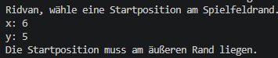
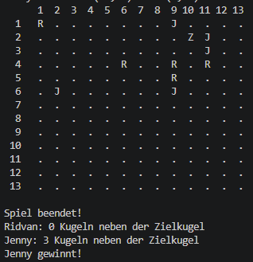

## Computer-Pétanque wird auf einem 13 × 13 Felder großen Spielfeld gespielt.

Die Spieler Ridvan und Jenny werfen abwechselnd ihre Kugeln in Richtung einer
zufällig platzierten Zielkugel.

Jeder Spieler wählt vor seinem Wurf eine Startposition am äußeren Rand des
Spielfelds. Anschließend wird die Wurfrichtung in Richtung der Zielkugel
bestimmt. Die Kugel bewegt sich zufällig zwischen 0 und 5 Feldern in dieser
Richtung. Zusätzlich kann sie um ein Feld orthogonal von der Wurfrichtung
abweichen.

Da einige Regeln in der Aufgabenstellung nicht vollständig festgelegt sind,
wurden für die Umsetzung folgende Entscheidungen getroffen:

- Eine Partie besteht aus fünf Runden. In jeder Runde werfen beide Spieler
  jeweils einmal.
- Befindet sich die Zielkugel diagonal zur Startposition, wird zufällig
  entschieden, ob horizontal oder vertikal geworfen wird.
- Bei einer orthogonalen Abweichung wird zufällig zwischen den beiden möglichen
  Richtungen gewählt. Eine Abweichung außerhalb des Spielfelds wird nicht
  durchgeführt.
- Die Startposition darf nicht direkt auf der Zielkugel liegen.
- Landet eine Kugel auf einem bereits belegten Feld, wird die dort liegende
  Kugel um ein Feld in Wurfrichtung verschoben. Dadurch können Kettenreaktionen
  entstehen.
- Wird eine normale Spielerkugel aus dem Spielfeld geschoben, wird sie aus dem
  Spiel entfernt.
- Wird die Zielkugel aus dem Spielfeld geschoben, endet die Partie sofort
  unentschieden.
- Als „neben der Zielkugel“ gelten alle acht direkt angrenzenden Felder,
  einschließlich der diagonalen Felder.

Computer-Pétanque wird auf einem 13 × 13 Felder großen Spielfeld gespielt.
Die Spieler Ridvan und Jenny werfen abwechselnd ihre Kugeln in Richtung einer
zufällig platzierten Zielkugel.

Jeder Spieler wählt vor seinem Wurf eine Startposition am äußeren Rand des
Spielfelds. Anschließend wird die Wurfrichtung in Richtung der Zielkugel
bestimmt. Die Kugel bewegt sich zufällig zwischen 0 und 5 Feldern in dieser
Richtung. Zusätzlich kann sie um ein Feld orthogonal von der Wurfrichtung
abweichen.

Da einige Regeln in der Aufgabenstellung nicht vollständig festgelegt sind,
wurden für die Umsetzung folgende Entscheidungen getroffen:

- Eine Partie besteht aus fünf Runden. In jeder Runde werfen beide Spieler
  jeweils einmal.
- Befindet sich die Zielkugel diagonal zur Startposition, wird zufällig
  entschieden, ob horizontal oder vertikal geworfen wird.
- Bei einer orthogonalen Abweichung wird zufällig zwischen den beiden möglichen
  Richtungen gewählt. Eine Abweichung außerhalb des Spielfelds wird nicht
  durchgeführt.
- Die Startposition darf nicht direkt auf der Zielkugel liegen.
- Landet eine Kugel auf einem bereits belegten Feld, wird die dort liegende
  Kugel um ein Feld in Wurfrichtung verschoben. Dadurch können Kettenreaktionen
  entstehen.
- Wird eine normale Spielerkugel aus dem Spielfeld geschoben, wird sie aus dem
  Spiel entfernt.
- Wird die Zielkugel aus dem Spielfeld geschoben, endet die Partie sofort
  unentschieden.
- Als „neben der Zielkugel“ gelten alle acht direkt angrenzenden Felder,
  einschließlich der diagonalen Felder.

## Lösungsidee

Für die Umsetzung wurde das Spiel in mehrere Java-Klassen aufgeteilt. Dadurch
werden die verschiedenen Aufgaben des Programms voneinander getrennt und der
Quellcode bleibt übersichtlich.

Die Klasse Game enthält die zentrale Spiellogik. Sie steuert den Spielablauf,
wechselt zwischen den beiden Spielern, berechnet die Würfe, behandelt
Kollisionen und bestimmt am Ende den Gewinner.

Die Klasse Board repräsentiert das 13 × 13 große Spielfeld. Sie prüft, ob sich
eine Position innerhalb des Spielfelds oder am äußeren Rand befindet, und ist
für die Ausgabe des Spielfelds in der Konsole zuständig.

Die Klasse Player repräsentiert einen Spieler und speichert dessen Namen.
Im Spiel werden zwei Objekte für Ridvan und Jenny erzeugt.

Die Klasse Ball repräsentiert sowohl die Spielerkugeln als auch die Zielkugel.
Eine Kugel besitzt eine Position und einen Besitzer. Zusätzlich wird gespeichert,
ob es sich um die Zielkugel handelt.

Die Klasse Position speichert die x- und y-Koordinaten eines Feldes.

Die Klasse App enthält die main-Methode und startet das Spiel.

App
 │
 ▼
Game
 ├── Board
 ├── Player (Ridvan)
 ├── Player (Jenny)
 ├── Ball
 └── Position

 ## Umsetzung des Spielablaufs

Beim Start des OProgramms wird zunächst die Zielkugel zufällig auf einem Feld
des 13 × 13 großen Spielfelds platziert. Danach wird das Spielfeld in der
Konsole ausgegeben.

Das Spiel besteht aus fünf Runden. In jeder Runde sind Ridvan und Jenny
abwechselnd an der Reihe. Der aktuelle Spieler gibt eine x- und eine
y-Koordinate für seine Startposition ein. Das Programm überprüft, ob die
Position innerhalb des Spielfelds und am äußeren Rand liegt.

Anschließend wird die Landeposition der Kugel berechnet. Dafür wird zunächst
eine Wurfrichtung in Richtung der Zielkugel bestimmt. Die Wurfweite wird
zufällig zwischen 0 und 5 Feldern gewählt. Zusätzlich kann eine zufällige
orthogonale Abweichung um ein Feld auftreten.

Nach dem Wurf wird geprüft, ob das Landefeld bereits belegt ist. Ist dies der
Fall, wird die dort liegende Kugel um ein Feld in Wurfrichtung verschoben.
Sind weitere Felder belegt, werden die Kugeln rekursiv weitergeschoben.

Nach jedem Wurf wird das aktualisierte Spielfeld ausgegeben und anschließend
zum anderen Spieler gewechselt.

Wird die Zielkugel aus dem Spielfeld geschoben, endet das Spiel sofort
unentschieden. Andernfalls werden nach der letzten Runde die Kugeln auf den
acht angrenzenden Feldern der Zielkugel gezählt. Der Spieler mit den meisten
Kugeln in diesem Bereich gewinnt. Bei gleicher Anzahl endet das Spiel
unentschieden.

## Wichtige Implementierungsdetails

### Berechnung des Wurfs

Die Landeposition einer Kugel wird zufällig berechnet. Zunächst wird bestimmt,
in welcher Richtung die Zielkugel von der Startposition liegt. Anschließend
wird eine zufällige Wurfweite zwischen 0 und 5 Feldern erzeugt.

Liegt die Zielkugel sowohl horizontal als auch vertikal versetzt, wird zufällig
zwischen einer horizontalen und einer vertikalen Wurfrichtung gewählt.
Zusätzlich kann die Kugel orthogonal um ein Feld abweichen.

int distance = random.nextInt(6);

if (differenceX == 0) {
    moveHorizontal = false;
} else if (differenceY == 0) {
    moveHorizontal = true;
} else {
    moveHorizontal = random.nextBoolean();
}

### Kollisionen und Kettenreaktionen

Wenn eine Kugel auf ein bereits belegtes Feld geschoben wird, wird geprüft,
ob sich auf dem nächsten Feld ebenfalls eine Kugel befindet.

Ist dies der Fall, wird die Methode pushBall() erneut für diese Kugel
aufgerufen. Dadurch entsteht eine rekursive Kettenreaktion, bis ein freies
Feld erreicht wird oder eine Kugel das Spielfeld verlässt.

Ball nextBall = getBallAt(newPosition);

if (nextBall != null) {
    pushBall(nextBall);
}

Durch den rekursiven Aufruf können mehrere hintereinanderliegende Kugeln
nacheinander verschoben werden.

### Gewinnerermittlung

Nach der letzten Runde wird für jede Spielerkugel geprüft, ob sie sich direkt
neben der Zielkugel befindet. Dazu werden die Abstände der x- und
y-Koordinaten zur Zielkugel berechnet.

Beträgt der Abstand in beiden Richtungen höchstens ein Feld, wird die Kugel
gewertet. Das Feld der Zielkugel selbst wird ausgeschlossen. Dadurch werden
alle acht umliegenden Felder berücksichtigt.

Anschließend werden die gewerteten Kugeln für Ridvan und Jenny gezählt und
miteinander verglichen.

int differenceX = Math.abs(ballX - targetX);
int differenceY = Math.abs(ballY - targetY);

return differenceX <= 1
        && differenceY <= 1
        && !(differenceX == 0 && differenceY == 0);

## Testfälle und Spielbeispiele

Um die korrekte Funktion des Programms zu überprüfen, wurden verschiedene
Spielsituationen getestet. Dabei wurden sowohl normale Spielabläufe als auch
Sonderfälle berücksichtigt.

### Gültige und ungültige Startpositionen

Es wurde überprüft, ob nur Startpositionen am äußeren Rand des Spielfelds
akzeptiert werden. Positionen innerhalb des Spielfelds sowie Koordinaten
außerhalb des Bereichs von 1 bis 13 werden abgelehnt.

Zusätzlich wurde getestet, dass ungültige Eingaben wie Buchstaben nicht zum
Absturz des Programms führen.

### Normaler Spielablauf

Bei einem normalen Spiel werden Ridvan und Jenny abwechselnd aufgerufen.
Nach jedem Wurf wird die berechnete Landeposition ausgegeben und das
aktualisierte Spielfeld angezeigt. Nach fünf Runden wird das Spielergebnis
ermittelt.

### Kollision und Kettenreaktion

Ein weiterer Test betrifft die Kollision mehrerer Kugeln. Landet eine Kugel
auf einem belegten Feld, wird die vorhandene Kugel in Wurfrichtung
weitergeschoben.

Sind mehrere aufeinanderfolgende Felder belegt, werden die Kugeln durch
rekursive Aufrufe nacheinander verschoben.

Vorher:

R → J → R → .

Nach dem Verschieben:

. → R → J → R

### Zielkugel wird aus dem Spielfeld geschoben

Als Sonderfall wurde berücksichtigt, dass die Zielkugel aus dem Spielfeld
geschoben werden kann. In diesem Fall wird die Variable draw auf true gesetzt
und die Partie sofort als unentschieden beendet.

### Gewinnerermittlung

Nach einem regulären Spielende werden die Kugeln neben der Zielkugel gezählt.
Anschließend werden die Ergebnisse beider Spieler verglichen. Der Spieler mit
mehr angrenzenden Kugeln gewinnt. Bei gleicher Anzahl endet die Partie
unentschieden.

## Verwendete Hilfsmittel

Für die Entwicklung des Programms wurde Java verwendet.

Die Implementierung erfolgte in Visual Studio Code. Zum Kompilieren und
Ausführen des Programms wurde das Java Development Kit verwendet.

Zur Strukturierung des Programms wurden mehrere Klassen erstellt, unter
anderem Game, Board, Player, Ball und Position.

Für zufällige Spielereignisse wurde die Java-Klasse Random verwendet.
Die Benutzereingaben in der Konsole werden mit Scanner verarbeitet.

Zur Unterstützung bei der Planung, Erklärung einzelner Java-Konzepte und
Überprüfung der Programmstruktur wurde ChatGPT verwendet. Die Entscheidungen
zur Umsetzung und die Anpassung des Quellcodes wurden dabei schrittweise
nachvollzogen und getestet.

## Fazit

Das Ziel der Aufgabe war die Entwicklung einer spielbaren Version von
Computer-Pétanque.

Das Spiel wurde als Java-Konsolenanwendung umgesetzt. Dabei wurden unter
anderem die zufällige Bewegung der Kugeln, Kollisionen mit Kettenreaktionen,
das Verschieben der Zielkugel und die Gewinnerermittlung implementiert.

Besonders interessant war die Umsetzung der rekursiven Verschiebung mehrerer
Kugeln. Außerdem mussten einige nicht vollständig festgelegte Spielregeln
präzisiert und anschließend konsistent im Programm umgesetzt werden.

Das entstandene Programm ermöglicht eine vollständige Partie zwischen Ridvan
und Jenny und behandelt sowohl normale Spielabläufe als auch verschiedene
Sonderfälle.

